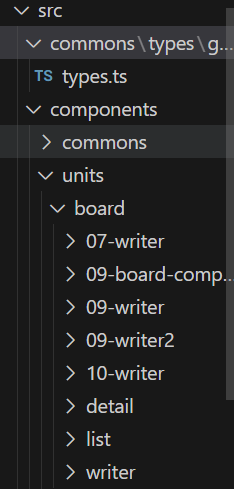

# Class Project

## 프로젝트 설명
Class 프로젝트는 Next.js를 기반으로 한 웹 애플리케이션입니다. 이 프로젝트는 다양한 기능을 제공하며, React를 사용한 컴포넌트 기반 구조로 개발되었습니다.

## 기술 스택

## 프로젝트 구조

### 폴더 구조 설명
- **pages/section02 - section13:**
  - 각 섹션 폴더는 섹션별로 분리된 페이지를 포함.
  - **index.tsx:** 각 섹션의 메인 페이지.
- **_app.tsx:** 모든 페이지에 공통으로 적용되는 설정.
- **index.tsx:** 메인 페이지

## 주요 라이브러리 및 설명
- **@ant-design/icons, antd:** UI 라이브러리로 다양한 컴포넌트와 아이콘을 제공.
- **@apollo/client:** GraphQL 클라이언트로, GraphQL API와 상호작용.
- **@emotion/react, @emotion/styled:** CSS-in-JS 라이브러리로 스타일을 작성.
- **axios:** HTTP 클라이언트로, API 호출을 처리.
- **graphql:** GraphQL 쿼리 언어를 사용.
- **next:** React 기반의 프레임워크로 서버 사이드 렌더링과 정적 사이트 생성을 지원.
- **react, react-dom:** 사용자 인터페이스를 구축하기 위한 라이브러리.
- **react-daum-postcode:** Daum 우편번호 검색 서비스를 React에서 사용.
- **react-youtube:** YouTube 동영상을 React 컴포넌트로 쉽게 임베드.
- **ts-node:** TypeScript 파일을 직접 실행할 수 있게 하는 Node.js 도구.
- **@graphql-codegen/cli, @graphql-codegen/typescript:** GraphQL 코드 생성을 위한 도구.
- **@types/node, @types/react, @types/react-dom:** TypeScript용 타입 정의 파일.
- **typescript:** 정적 타입을 제공하는 JavaScript의 상위 집합 언어